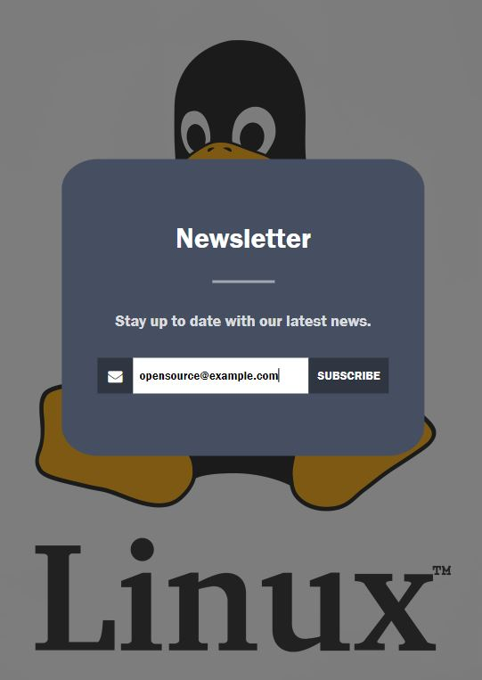

# Newsletter-form

This is simply newsletter-form written in HTML using CSS. You can put your e-mail address into the box click 'subscribe' and with a simple php script you will be redirected to the page confirming your subscription.
Important! It's just a form of newsletter. If You want sending your email You need to configure mail server to do that. You can use the following - https://github.com/PHPMailer/PHPMailer

## Running the app

  

  

